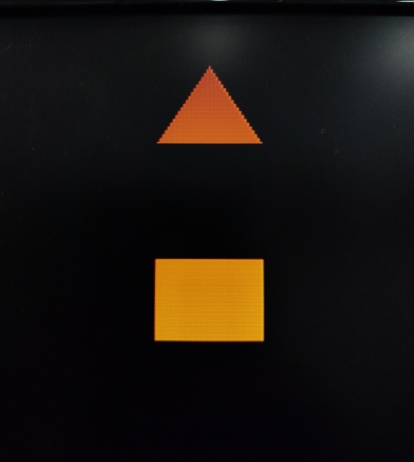
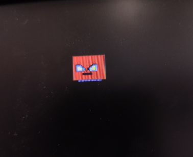
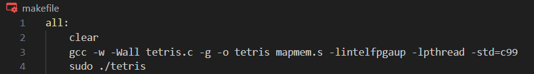

---

## **Contexto do Projeto**

Para este projeto, o objetivo é desenvolver um jogo inspirado no clássico Tetris para a plataforma DE1-SoC, com o diferencial de criar uma biblioteca gráfica em Assembly para manipulação de vídeo, enquanto o restante do código será escrito em C. A biblioteca gráfica será responsável por desenhar os elementos do jogo diretamente na interface VGA, permitindo a exibição do jogo em um monitor sem o uso de bibliotecas de vídeo externas.

O controle do jogo será feito com um acelerômetro integrado, programado em C. A movimentação das peças será controlada pelos dados de inclinação do acelerômetro, dispensando o uso de bibliotecas específicas para esse sensor e exigindo que os alunos implementem a captura e interpretação dos dados diretamente. 

---

---

## **Objetivos de Aprendizagem**
Ao final deste projeto, o/a discente será capaz de:

1. **Aplicar conhecimentos de interação hardware-software;**
2. **Compreender o mapeamento de memória em uma arquitetura ARM;**
3. **Utilizar a interface de conexão entre HPS e FPGA da DE1-SoC;**
4. **Programar em assembly para um processador com arquitetura ARM;**
5. **Entender políticas de gerenciamento de sistema operacional Linux em arquitetura ARM;**
6. **Compreender os princípios básicos da arquitetura da plataforma DE1-SoC.**

---

## **Requisitos**

1. **O código da biblioteca deve ser escrito em linguagem aseembly;**
2. **A biblioteca deve conter as funções essenciais para que seja possível implementar a parte gráfica do jogo usando o Processador Gráfico;**
3. **Não é permitido o uso de bibliotecas para o acelerômetro;**
4. **A biblioteca deve seguir as recomendações descritas em: https://github.com/MaJerle/c-code-style**

---
## **Sumário**

        <ul>
        <li><a href="#sft_ut"> Softwares Utilizados </a></li>
        <li><a href="#kit_placa"> Kit de Desenvolvimento DE1-SoC</a></li>
        <li><a href="#acl345"> Acelerômetro ADXL345</a></li>
        <li><a href="#lib_as"> Biblioteca Gráfica em Assembly<a><li>
        <li><a href="#gamerules"> Funcionamento do jogo</a></li>
        <li><a href="#test"> Testes</a></li>
        <li><a href="#makefile"> Como executar o Jogo</a></li>
        <li><a href="#resultado"> Resultados alcançados</a></li>
        <li><a href="#conclusion"> Conclusão</a></li>
        <li><a href="#aln"> Alunos</a></li>
        <li><a href="#crd"> Créditos</a></li>
        </ul>

---

## **Softwares Utilizados**

<code></code>
<code></code>
<code></code>
<code></code>

### GNU/Linux
Por fim, o kit de desenvolvimento DE1-SoC possui uma distribuição do Linux embarcado instalada, possibilitando a comunicação com o kit bem como a execução dos códigos criados através de conexão remota. Isso oferece uma gama de possibilidades para a elaboração do problema: a disposição dos diretórios do sistema e a possibilidade de compilar códigos na linguagem de programação requisitada de forma fácil com o compilador gcc embarcado no kit de desenvolvimento foram fundamentais.

### VS Code
O Visual Studio Code (VS Code) é uma ferramenta popular e altamente funcional utilizada em uma variedade de projetos de desenvolvimento de software. O uso dele foi necessário para agilizar o desenvolvimento, permitindo editar, depurar e gerenciar o código de maneira simplificada e eficaz.

### C
A linguagem C é amplamente utilizada em projetos devido à sua eficiência e versatilidade. Com sua sintaxe direta e controle próximo sobre o hardware, o C permite desenvolver programas robustos e rápidos, especialmente em sistemas embarcados, drivers de dispositivos e software de baixo nível. No contexto deste projeto, a utilização da linguagem C foi um dos requisitos necessarios a serem cumpridos.

### Assembly
O Assembly é uma linguagem de programação de baixo nível que está intimamente ligada à arquitetura do processador. Diferente de linguagens de alto nível como C ou Python, que são mais abstratas, o Assembly oferece um controle direto sobre o hardware, permitindo que o programador interaja com os registradores, memória e outras características do processador de forma explícita.

## **Kit de Desenvolvimento DE1-SoC**

O kit de desenvolvimento DE1-SoC é uma plataforma de prototipagem projetada para o desenvolvimento de sistemas embarcados e aplicações em FPGA (Field-Programmable Gate Array). Este kit é equipado com um FPGA da Altera (atualmente Intel), que permite a implementação de circuitos digitais personalizados. Abaixo tem os componentes principais dessa placa.

---

## **Acelerômetro ADXL345**
O ADXL345 é um acelerômetro de baixa potência e alta precisão, capaz de medir acelerações em três eixos (X, Y, Z). Ele é comumente utilizado em aplicações como medição de inclinação, detecção de movimento, controle de gestos, além de monitoramento de atividades em dispositivos portáteis. Seu uso se destaca pela facilidade de comunicação via interfaces I2C ou SPI e pela capacidade de operar em diferentes faixas de aceleração, como ±2g, ±4g, ±8g e ±16g.

### Uso do ADXL345 no projeto
No projeto, o ADXL345 foi utilizado para capturar as acelerações no eixo X, que são convertidas em movimento dentro do jogo Tetris. Dependendo da aceleração lida no eixo X, a peça se move para a esquerda ou para a direita no tabuleiro, proporcionando uma forma de controle por meio de inclinação.

Etapas do uso:
1. **Configuração Inicial:** Antes de realizar a leitura dos dados, o acelerômetro foi configurado para operar com uma faixa de medição de ±2g, suficiente para capturar os movimentos suaves de inclinação que desejávamos monitorar. Para isso, utilizamos a interface I2C para enviar os comandos de configuração e ativação. Isso foi feito nas seguintes etapas:

    Configuração dos registradores de controle do ADXL345, como o registrador de formato de dados (DATA_FORMAT) e o registrador de controle de energia (POWER_CTL). 
    Definição da taxa de amostragem: Configuramos o ADXL345 para operar a uma taxa de 100 Hz, o que foi ajustado no registrador BW_RATE.
2. **Leitura dos Dados:** A leitura da aceleração no eixo X é feita em dois bytes: o primeiro (DATAX0) contém os 8 bits menos significativos, e o segundo (DATAX1) contém os 8 bits mais significativos. Os dois bytes são combinados para formar um valor de 16 bits que representa a aceleração no eixo X. O código responsável por essa leitura está na função ler_aceleracao_x().
3. **Calibração:** Para garantir que o sensor estivesse devidamente ajustado, realizamos uma calibração inicial, durante a qual o sensor foi mantido em repouso. Foram feitas várias leituras da aceleração e, a partir dessas leituras, foi calculado um offset que foi subtraído das leituras subsequentes para compensar qualquer desvio do eixo X.
4. **Conversão para Gravidade (G):** A aceleração bruta lida pelo ADXL345 foi convertida para a unidade de gravidade (g) usando a relação entre o valor bruto e a resolução configurada. Para a faixa de ±2g, a conversão foi feita dividindo o valor bruto por 256, obtendo assim a aceleração em "g". O fator de conversão foi ajustado com base na resolução de 4 mg/LSB (miligrama por unidade de valor bruto).
5. **Movimento no Jogo:** Com base nos valores lidos do acelerômetro, a lógica do jogo foi adaptada para interpretar os valores de aceleração no eixo X. Valores positivos ou negativos acima de um certo limiar indicam movimento para a direita ou para a esquerda, respectivamente. Valores abaixo desse limiar são interpretados como ausência de movimento. Isso foi implementado na função get_direcao_movimento().

---

## **Biblioteca Gráfica em Assembly**
A biblioteca gráfica em Assembly apresentada foi desenvolvida para interagir diretamente com o hardware de um FPGA, utilizando a interface /dev/mem para mapear e acessar os registradores de controle do dispositivo. O objetivo principal dessa biblioteca é fornecer um conjunto de funções para manipulação da tela, incluindo a configuração de cores de fundo, desenho de formas geométricas, e controle de sprites. Cada função é cuidadosamente projetada para acessar registradores específicos de controle do FPGA, garantindo a manipulação eficiente dos recursos gráficos.

As funções são implementadas com chamadas diretas ao sistema operacional para abrir e mapear o arquivo especial /dev/mem, que permite o acesso direto à memória do dispositivo. A biblioteca utiliza operações de baixo nível para escrever e ler dados dos registradores, controlando as operações gráficas, como a cor de fundo, a renderização de polígonos e sprites, além de verificar o status do FIFO para garantir a sincronização das operações.

A seguir, será apresentada uma descrição detalhada das funções dessa biblioteca, explicando sua finalidade e a forma como manipulam o hardware para gerar as saídas gráficas desejadas. Essas funções são essenciais para qualquer aplicação gráfica que precise de um controle direto sobre o hardware, permitindo o desenvolvimento de interfaces personalizadas ou sistemas embarcados com recursos gráficos.

1. **Branch "open_devmem"** 
 Esta função abre o dispositivo /dev/mem, que fornece acesso direto à memória do sistema para leitura e escrita. Ela começa salvando registradores na pilha para restaurá-los ao final. Em seguida, configura as chamadas de sistema para leitura/escrita (syscall open) e usa mmap2 para mapear uma região específica da memória, conectando-se ao endereço base da FPGA. O endereço mapeado é armazenado em mapped_address, e os registradores salvos são restaurados ao final da função.

2. **Branch "close_devmem"** 
Esta função desmonta e fecha o dispositivo /dev/mem. Ela libera a região de memória mapeada anteriormente usando munmap, para evitar vazamentos de memória. Em seguida, realiza o fechamento do dispositivo /dev/mem, restaurando os registradores da pilha antes de retornar.

3. **Branch "bg_block"** 
Esta função define uma posição específica na tela com uma determinada cor, criando um bloco no plano de fundo. A posição é passada como parâmetro (r0) e a cor como r1. A função manipula os registradores wrreg, data_a e data_b para escrever a cor do bloco na memória. Antes de habilitar a escrita, a função chama check_fifo para verificar se há espaço no FIFO, garantindo que a operação de escrita não cause um overflow.

4. **Branch "check_fifo"** 
Esta função auxiliar verifica se há espaço no buffer FIFO (um tipo de estrutura de dados que funciona como uma fila) antes de cada escrita. Ela lê o registrador de status do FIFO em um loop até que haja espaço disponível, evitando assim que novas escritas ocorram enquanto o FIFO estiver cheio.

5. **Branch "poligono"** 
A função "poligono" é responsável por desenhar polígonos, como quadrados e triângulos, na tela com uma cor e posição específicas, utilizando registradores e mapeamento de endereço na FPGA. Ela recebe como parâmetros a cor (r0), o tamanho (r1), o tipo de forma (r2), o registrador de destino (r3), a posição X (r4) e a posição Y (r5). A função começa salvando os registradores na pilha e mapeando o endereço base da FPGA. Em seguida, ela configura os registradores DATAA e DATAB com o opcode para desenhar o polígono, as coordenadas, a cor, o tamanho e a forma, ajustando os valores conforme o layout esperado pelo hardware. A função verifica o espaço disponível no FIFO antes de escrever nos registradores da FPGA e, ao final, restaura os registradores e retorna ao ponto de execução original. Esse processo garante a renderização precisa do polígono na tela.

6. **Branch "bg_color"** 
Esta função configura a cor de fundo da tela. A cor é passada como parâmetro em r0. A função acessa o endereço mapeado da FPGA, configurando o registrador data_b com a cor desejada. Em seguida, usa data_a para enviar o código de operação (opcode) para selecionar o registrador de fundo (background). Antes de habilitar a escrita no registrador wrreg, ela chama check_fifo para garantir que o FIFO tenha espaço. Assim, a cor de fundo é definida com segurança. Após a operação de escrita, a função desativa o sinal de escrita para evitar que outras operações alterem o fundo inesperadamente.

7. **Branch "set_sprite"** 
Esta função posiciona um sprite na tela e configura suas propriedades. Ela recebe parâmetros como posição X (px), posição Y (py), offset (identifica o sprite) e sp (bit que ativa/desativa o sprite) junto com o registrador de destino. A função constrói os dados necessários para a instrução DATAA, combinando o código de operação com o registrador e o offset do sprite. A seguir, constrói o valor de DATAB com as coordenadas de posição e outros atributos do sprite. Assim como em outras operações de escrita, a função desativa e reativa wrreg para controlar o momento exato da escrita no hardware.

8. **Branch "acess_btn"** 
Esta função permite acessar o estado dos botões conectados ao sistema. Ela acessa diretamente o registrador de endereço base dos botões e carrega o valor no registrador r0, que representa o estado atual dos botões (pressionado ou não). A função retorna imediatamente o valor lido, permitindo ao software verificar quais botões foram acionados.

9. **Branch "acess_display"** 
Esta função lê o estado dos displays numéricos conectados ao sistema (seis displays no total). Ela acessa sequencialmente cada registrador de display a partir do endereço base e carrega o valor no registrador r0. Com isso, a função permite que o software obtenha o estado atual de cada display para exibir informações ou realizar diagnósticos.

**Mais alguns detalhes:** 
Todas essa funções foram feitas seguindo o passo a passo para a configuração dos barramentos DATA A e DATA B que está no TCC de @Gabriel B. Alves (Desenvolvimento de uma Arquitetura Baseada em
Sprites para criação de Jogos 2D em Ambientes
Reconfiguráveis utilizando dispositivos FPGA). Disponível em: https://drive.google.com/file/d/1MlIlpB9TSnoPGEMkocr36EH9-CFz8psO/view

---

## **Funcionamento do Jogo**

1. Estrutura Básica do Jogo: 
O jogo é inspirado no Tetris, onde o objetivo é posicionar peças de diferentes formas para completar linhas e eliminá-las.
As peças caem automaticamente no tabuleiro, e o jogador as controla através do acelerômetro e dos botões da placa DE1-SoC.
O jogo termina quando uma nova peça não consegue ser posicionada devido à falta de espaço (Game Over).
2. Peças e Movimentação: 
O jogo tem 7 tipos de peças (formas), cada uma com uma cor e configuração específicas, representadas por matrizes 2D.
As peças caem gradualmente de cima para baixo, e o jogador pode movê-las para a esquerda ou direita com base no valor do acelerômetro.
Rotação das peças é feita com o botão 0, e a movimentação horizontal se baseia no valor de accelX, lido do acelerômetro.
As funções verificam constantemente se a nova posição da peça é válida, evitando colisões ou saídas dos limites do tabuleiro.
3. Verificação de Posições e Colisões: 
A função CheckPosition é responsável por verificar se a posição atual da peça é válida (sem sair dos limites ou colidir com outras peças).
Caso a peça colida ou saia dos limites, o jogo impede o movimento e mantém a peça na sua posição atual.
4. Atualização do Tabuleiro: 
Quando uma peça atinge o fundo do tabuleiro ou colide com outra peça, ela se torna parte permanente do array Table.
A função WriteToTable insere a peça atual no tabuleiro, fixando sua posição e permitindo que uma nova peça seja gerada.
5. Detecção e Remoção de Linhas Completas: 
A função Check_lines verifica se alguma linha foi completada (quando todas as colunas de uma linha estão preenchidas).
Se uma linha completa for detectada, ela é removida, e as linhas acima são movidas para baixo, criando espaço.
Cada linha eliminada aumenta a pontuação em 100 pontos, e a velocidade de queda das peças é aumentada conforme o número de linhas completas.
6. Controle de Queda e Atraso: 
A função fallDelay define o tempo de espera entre cada "queda" automática da peça, inicialmente em 80ms.
Esse tempo diminui conforme mais linhas são completadas, acelerando o ritmo do jogo e aumentando a dificuldade.
7. Thread para Leitura do Acelerômetro: 
A leitura do valor do eixo X do acelerômetro é feita em uma thread separada, que atualiza o valor continuamente enquanto o jogo está em execução.
Isso permite que a movimentação das peças ocorra de forma fluida, sem interromper o fluxo principal do jogo.
8. Pause e Game Over: 
O jogador pode pausar o jogo a qualquer momento pressionando o botão 2, que exibe uma mensagem de pausa na tela e suspende o jogo até que o botão seja pressionado novamente.
Quando não há mais espaço para posicionar uma nova peça, o jogo exibe a mensagem de Game Over e termina.
9. Gerenciamento da Memória das Peças: 
As peças são geradas dinamicamente através da função CopyShape, que faz uma cópia da peça original.
Ao rotacionar ou descartar uma peça, a memória alocada é liberada usando a função DeleteShape para evitar vazamento de memória.

---

## **Testes** 
Alguns gif's abaixo descreve os testes feito durante o desenvolvimento.

### Pause

---
### Rotação

---
### Poligono

---
### Sprite

---

 

## **Como executar o Jogo**

### Makefile
Este Makefile fornece uma maneira simples e eficaz de compilar e executar seu projeto de Tetris, garantindo que as dependências necessárias sejam incluídas e que o ambiente esteja limpo antes da execução. A utilização de sudo indica que a aplicação pode interagir diretamente com o hardware, o que é comum em projetos que envolvem FPGAs e sistemas embarcados.

1. all: 
Este é o alvo padrão do Makefile. Quando você executa make sem especificar um alvo, o Makefile executa o alvo all. Neste caso, não há dependências definidas, então ele sempre executará as instruções subsequentes.

2. clear: 
Este comando é utilizado para limpar a tela do terminal antes de compilar e executar o programa. Isso ajuda a manter a saída do terminal organizada e facilita a visualização dos resultados.

3. gcc -w -Wall tetris.c -g -o tetris mapmem.s -lintelfpgaup -lpthread -std=c99 
Este comando utiliza o GCC (GNU Compiler Collection) para compilar o código-fonte do jogo Tetris: 

•gcc: Chama o compilador GCC (GNU Compiler Collection) para compilar o código. 
•-w: Suprime todos os warnings (mensagens de alerta) do compilador. 
•-Wall: Habilita a exibição de todos os warnings do compilador, que pode ajudar a identificar problemas potenciais no código. 
tetris.c: Arquivo de código-fonte C que será compilado. 
•-g: Adiciona informações de depuração (útil para debugging) ao binário gerado. 
•-o tetris: Especifica o nome do arquivo de saída, que será o executável chamado tetris. 
mapmem.s: Um arquivo de código Assembly que também será incluído no processo de compilação. 
•-lintelfpgaup: Linka a biblioteca libintelfpgaup, provavelmente uma biblioteca para interagir com um hardware específico. 
•-lpthread: Linka a biblioteca pthread, necessária para programação com threads em C. 
•-std=c99: Define que o código C será compilado de acordo com o padrão C99
4. sudo ./tetris:  
Após a compilação bem-sucedida, este comando executa o programa resultante (tetris). O uso de sudo sugere que o programa pode precisar de permissões elevadas para acessar recursos específicos do sistema ou hardware, como acessar o FPGA no kit DE1-SoC.

### Execução do Makefile

Ao implementar o makifile, facilitou-se ativamente na execução do jogo. Segue um passo a passo de como é feito:
1. O usuário deve conectar ao kit de desenvolvimento De1-Soc;
2. Entrar no diretório onde está o projeto;
3. Escrever no terminal a palavra chave "make";
4. Digitar a senha do usuário do pc;

Desse modo, o projeto vai iniciar a execução.

---

 

## **Resultados Alcançados**
Apos a implementação do projeto, todos os resultados estabelecidos foram alcançados com sucesso, gerando aprendizagem e sastifação para os desenvolvedores.  
Alem disso, é possível, enquanto execução, pausar o jogo e posteriormente, após o comando, continar, e também, o usuário pode ratacionar a peça utilizando o botão 1 (KEY 01) da placa, gerando mais entretenimento e sastifação aos jogadores.

---

 

## **Conclusão**
Em suma, o projeto foi executado com sucesso. Apesar dos desafios iniciais relacionados à integração do acelerômetro, o jogo demonstrou ser funcional e atendeu aos requisitos estabelecidos. Além disso, essa experiência foi crucial para aprofundar o entendimento sobre o kit de desenvolvimento, GNU/Linux embarcado e a interação entre hardware e software. Esse conhecimento adquirido certamente enriquecerá futuros projetos a serem desenvolvidos no kit DE1-SoC.

---

## **Alunos(as)**

<table align='center'>
<tr> 
  <td align="center">
    
     <b><a href="https://github.com/LuisMarioRC">Luis Mario</a></b> 👨‍💻
  </td>
  <td align="center">
    
     <b><a href="https://github.com/laizagordiano">Laiza Gordiano</a></b> 👨‍💻
  </td>
  <td align="center">
    
     <b><a href="https://github.com/Ltiicia">Letícia Gonçalves</a></b> 👨‍💻
  </td>
</tr>

</table>

---

### **Créditos**
Este projeto foi desenvolvido na disciplina TEC499 - MI de Sistemas Digitais (Semestre 2024.2) do curso de Engenharia de Computação da Universidade Estadual de Feira de Santana - UEFS.

---

